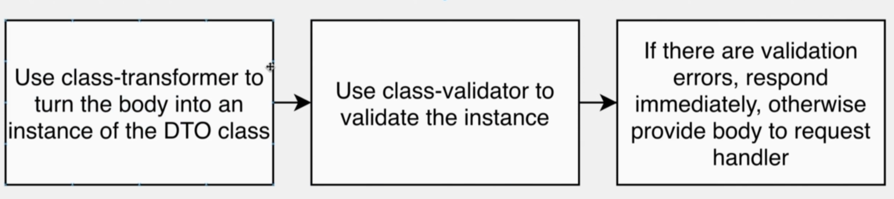

# Decorator metadata

The TypeScript compiler also includes experimental support for something called decorator metadata. Decorator metadata is metadata that is generated on class definitions in order to supplement the information that is passed into decorators. This option is called  emitDecoratorMetadata, and can be added to the  tsconfig.json  file, as follows:

    { 
        "compilerOptions": { 
           // other options 
            "experimentalDecorators": true 
            ,"emitDecoratorMetadata": true 
        } 
    } 

With this compile option in place,


```bash
npm install
```

## Running the app

```bash
# development
npm run start

# watch mode
npm run start:dev

# production mode
npm run start:prod
```

## Test

```bash
# unit tests
npm run test

# e2e tests
npm run test:e2e

# test coverage
npm run test:cov
```

