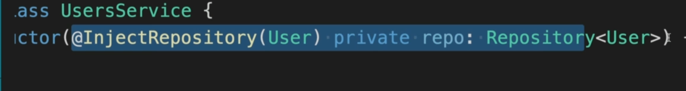
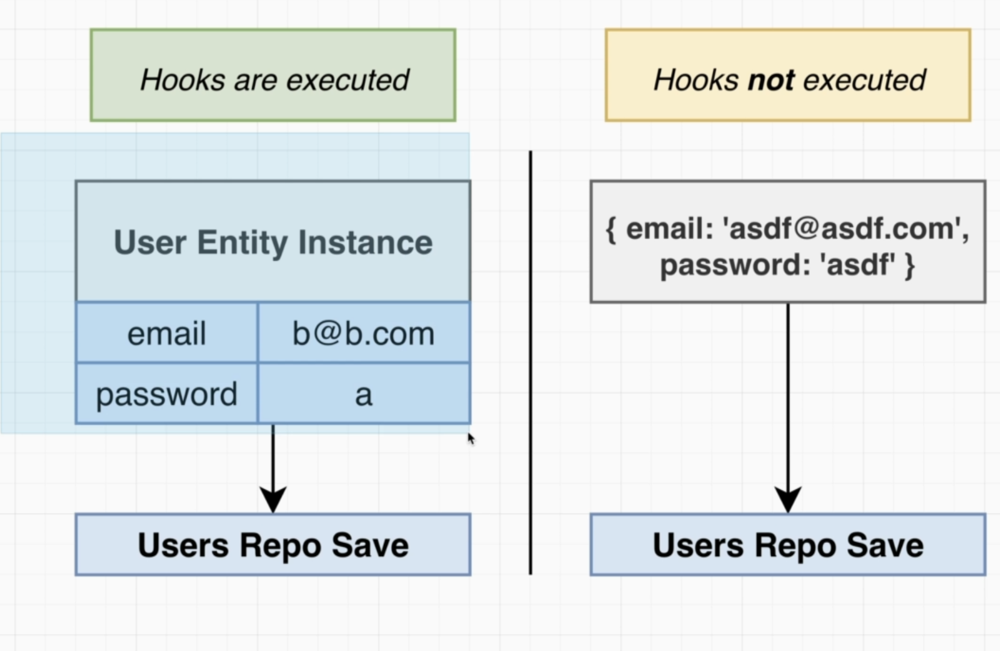

Unfortunately, the dependency injection system does not play nicely with generics, which is what this
So this decorator is required simply because we have to use a generic type right here.


```TypeScript
  @AfterInsert()
  logInsert() {
    console.log('Inserted User with id', this.id);
  }

  @AfterUpdate()
  logUpdate() {
    console.log('Updated User with id', this.id);
  }

  @AfterRemove()
  logRemove() {
    console.log('Removed User with id', this.id);
  }
```

