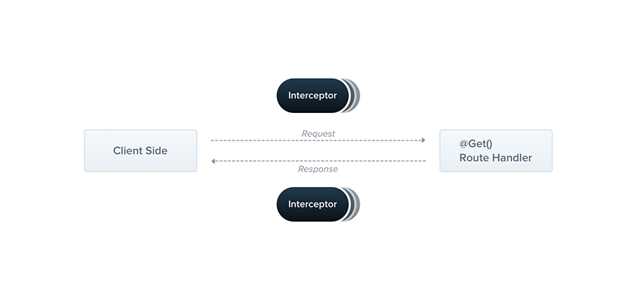

Interceptors have a set of useful capabilities which are inspired by the  [Aspect Oriented Programming](https://en.wikipedia.org/wiki/Aspect-oriented_programming)  (AOP) technique. They make it possible to:

-   bind extra logic before / after method execution
-   transform the result returned from a function
-   transform the exception thrown from a function
-   extend the basic function behavior
-   completely override a function depending on specific conditions (e.g., for caching purposes)

